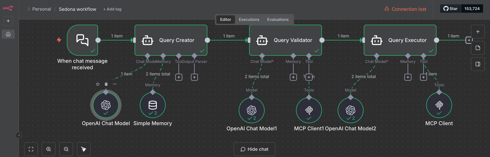
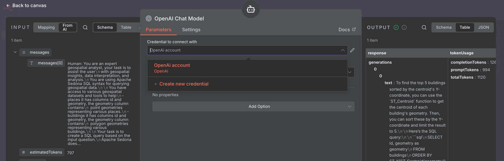
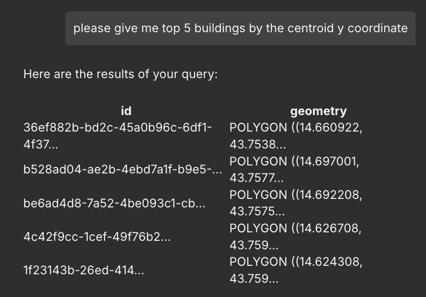

This is additional content for the book which couldn't
fit into the main chapters. It mainly contains additional examples
and extended explanations.

This part also is using the subchapter like split. 

1 Geospatial Agent with Apache Sedona
This part contains example which is using:
- n8n
- lm studio
- fast mcp server
- Apache Sedona as the engine to run spatial SQL queries

To run the example make sure you have the LM studio installed
https://lmstudio.ai/

and model which we tested on or allows using mcp server, we used
- ministral-8b-instruct-2410

Before you start make sure the lm studio is reachable and in the n8n
http://localhost:5678 add credentials to the Open AI chat Model

Click on the OpenAI building block

Then add the credentials

As the API KEY type anything, as the URL type the URL of your LM studio
for example http://host.docker.internal:1234/v1

Then you can use the chat inside the n8n workflow

In this example we use two tables from the Overture database
- buildings
- places

Both are covering the city of Prague in Czechia.

The workflow consist of the following steps:
1. Read the user question
2. Generate the initial SQL query using the chat model
3. Validate and correct the SQL query using the chat model and the MCP server method
4. Execute the SQL query using the Apache Sedona and MCP server method