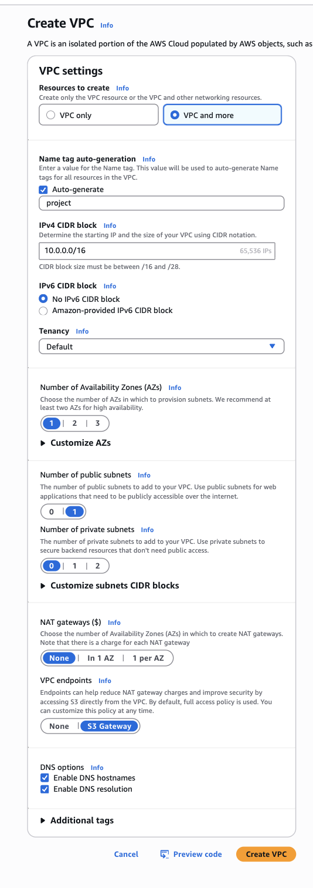

If you don't have EMR cluster ready, please follow the example:

setup AWS CLI
https://docs.aws.amazon.com/cli/latest/userguide/getting-started-install.html

login to AWS cli
https://docs.aws.amazon.com/signin/latest/userguide/command-line-sign-in.html

create VPC and subnet


create EMR cluster using the script below
fill the SUBNET_ID based on the subnet created above
fill the name of the bucket where your application will be stored and the logs

run the command

```bash
./create-emr-cluster.sh
```

then run the command to create Apache Sedona application step

fill the bucket name where your application is stored (the same as in the previous script)
fill the cluster id created in the previous step

```bash
./run-sedona.sh
```